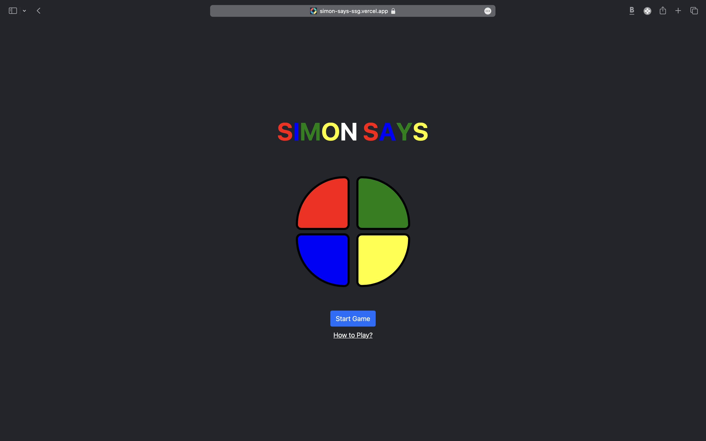

# Simon Says Game

## Live Demo

Try out the live version of the Simon Says game [here](https://simon-says-ssg.vercel.app).

## Description

Simon Says is a classic memory game where players must repeat a sequence of colors. This project is a web-based implementation of the game, built using HTML, CSS, Bootstrap, and JavaScript.

## How to Play

1. Click the "Start Game" button to begin.
2. Watch as the colors light up in a sequence.
3. Repeat the sequence by clicking on the colors in the same order.
4. Each successful repetition adds another color to the sequence.
5. Make a mistake, and the game ends.
6. Try to beat your highest score!

## Features

- Dynamic gameplay that gets progressively challenging with each level.
- Responsive design for seamless gameplay across devices.
- Keep track of your highest score and challenge your friends to beat it!

## Installation

To run the game locally, follow these steps:

1. Clone this repository: `git clone https://github.com/SurajSG-28/SimonSays.git`
2. Navigate to the project directory: `cd simonsays`
3. Open the `index.html` file in your web browser.

## Credits

This project was created by [Suraj Gharpankar](https://github.com/SurajSG-28).
